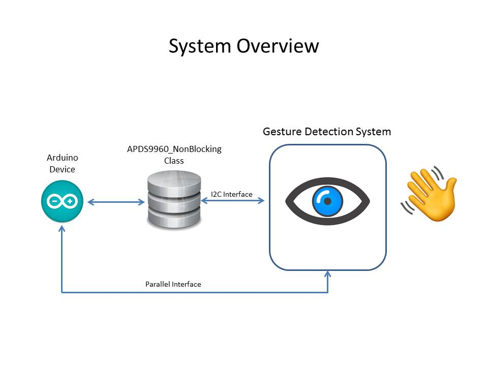
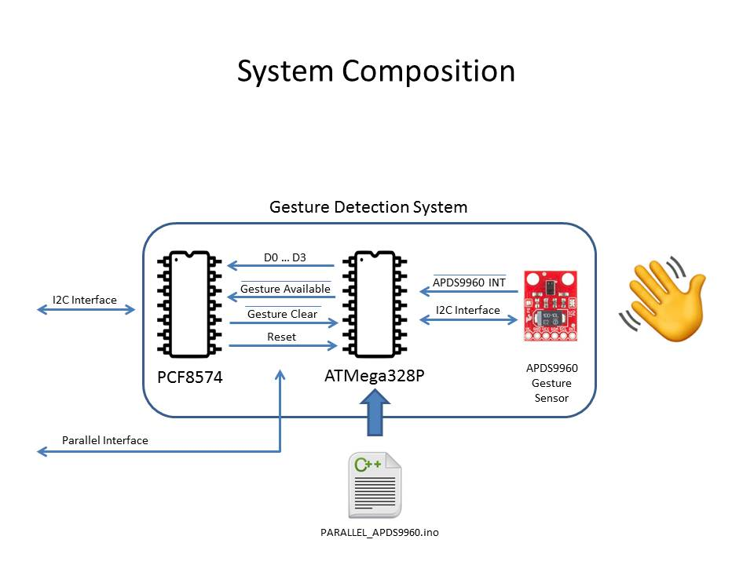
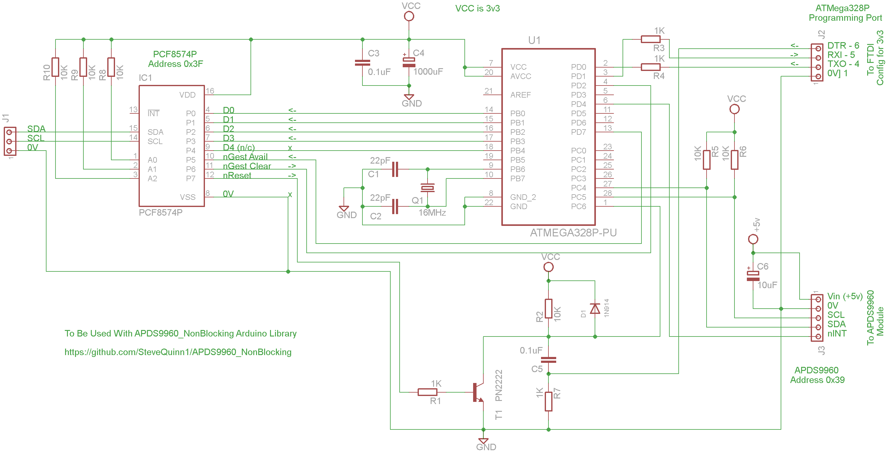
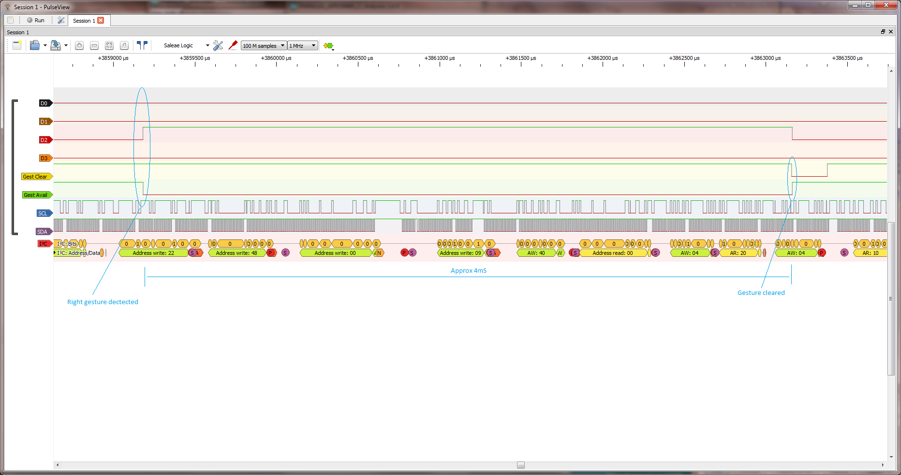

# APDS9960 NonBlocking Library

This is a detailed hybrid design for a NonBlocking implementation of the APDS9960 Gesture Sensor.

By Steve Quinn

Written to support the following Instructable;

https://www.instructables.com/id/ TBA

### APDS9960 NonBlocking System Overview

The library has been designed to provide NonBlocking implementation of the APDS9960 Gesture sensor to integrate into your Arduino designs.
It uses the I2C interface to cut down the I/O necessary, but it also allows for direction parallel control should you wish to do so.
Full examples of both I2C and Parallel implementations have included (code and circuit diagrams).

### APDS9960 NonBlocking System Composition

The system overview depicts at a high level, those component parts, including software necessary to assemble the design.
A full copy of the software for the ATMega328P is included.
If you are not familiar with programming bootloaders and code into and embedded Arduino then follow the examples given in this Instructable;

https://www.instructables.com/id/Programming-the-ATTiny85-ATTiny84-and-ATMega328P-A/

You will also require a forked version of the SparkFun_APDS-9960_Sensor_Arduino_Library available here;

https://github.com/SteveQuinn1/SparkFun_APDS-9960_Sensor_Arduino_Library

### Full circuit diagram

Full details of the circuit diagram for this design.

### Interface Logic Sequence

Logic sequence showing both I2C and Parallel interactions.

### Have a question?

Please email your questions here : <demomonkey@gmail.com>

### Download

Download the latest version (version 1) here :

https://github.com/SteveQuinn1/APDS9960_NonBlocking
